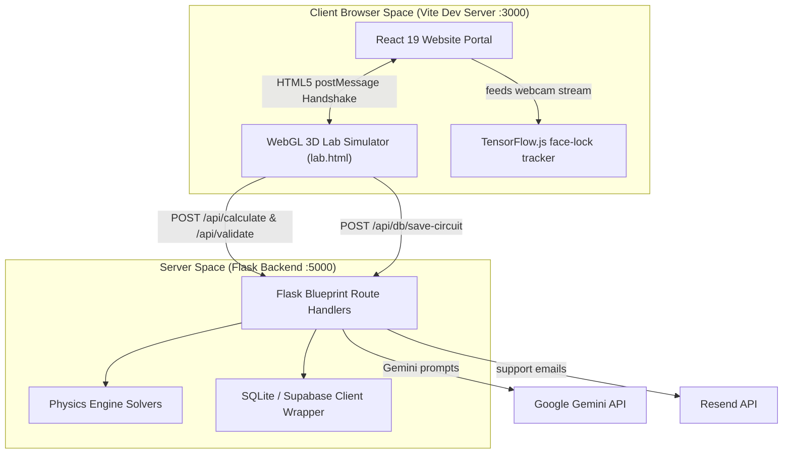

# ⚡ Circuit.IQ — Master System Architecture & Project Blueprint

Welcome to the central blueprint for **Circuit.IQ**, a high-fidelity 3D Virtual Physics Laboratory. This document outlines the system architecture, component directory mapping, decoupled communication interfaces, and unified development pipelines.

---

## 📖 Table of Contents
1. [🌐 System Architecture & Orchestration Flow](#-system-architecture--orchestration-flow)
2. [🔗 Decoupled iframe Communication Handshake](#-decoupled-iframe-communication-handshake)
3. [📂 Repository Component Map](#-repository-component-map)
4. [⚡ Key Subsystem Directories](#-key-subsystem-directories)
5. [💾 Database Synchronization & Persistent States](#-database-synchronization--persistent-states)
6. [🚀 Unified Development & Production Pipelines](#-unified-development--production-pipelines)

---

## 🌐 System Architecture & Orchestration Flow

Circuit.IQ leverages a decoupled, three-tier architecture combining a modern React SPA wrapper, a standalone WebGL 3D simulator, and a numerical Flask physics server.



### 🔌 Development vs. Production Execution

*   **Development mode**: Vite hosts the React portal on port `3000` and proxies all `/api/*` requests directly to Flask running on port `5000` via the proxy configuration defined in `vite.config.ts`.
*   **Production mode**: Running `python build_all.py` compiles the 3D WebGL simulator, transfers its compiled static bundles into the React public assets, builds the React portal production code into `dist/`, and moves those static files to the Flask server's web root. Flask serves both the static UI and the REST API endpoints concurrently on port `5000`.

---

## 🔗 Decoupled iframe Communication Handshake

The WebGL 3D simulator runs as a standalone Vanilla JS bundle inside an `iframe` component (`/lab.html?exp=<key>`) embedded in React. This prevents high WebGL CPU/GPU loops from locking the main React rendering thread. They communicate over a secure `postMessage` protocol:

| Message Payload / Event | Sender | Receiver | System Action |
| :--- | :--- | :--- | :--- |
| `window.parent.postMessage('close-lab', '*')` | 3D iframe | React Portal | Triggers `isLabOpen = false` in Zustand, closing the fullscreen lab workspace. |
| `contentWindow.postMessage({ type: 'theme-change', theme }, '*')` | React Portal | 3D iframe | Inverts background colors, WebGL fog properties, and CSS themes inside the simulator in real-time. |
| `window.parent.postMessage({ type: 'lab-loading', progress }, '*')` | 3D iframe | React Portal | Intercepts Three.js `LoadingManager` asset loading percentages to update the portal loading spinner. |
| `onLabPause()` / `onLabResume()` | React Portal | 3D iframe | Pauses or resumes WebGL animation loops, requestAnimationFrame ticks, and logs status to backend when the webcam eye tracker detects that the student is missing. |

---

## 📂 Repository Component Map

This folder tree represents the unified project directories and files:

```
Circuit.IQ/
├── build_all.py           # Production builder script (WebGL -> React -> Flask static)
├── start_dev.py           # Unified development server launcher (React + Flask)
├── circuit_iq.db          # Default local SQLite database file
├── README.md              # Master system documentation file
├── AI_HANDOVER.md         # Key state rules and DB instructions for AI assistants
├── DEVELOPER_GUIDE.md     # Code guidelines, custom plugin instructions, and CLI cheatsheet
│
├── READMEs/               # Centralized subsystem README files
│   ├── README_SYSTEM.md   # Overall architecture and postMessage bridge rules
│   ├── README_PORTAL.md   # React 19 portal and components map
│   ├── README_3D_SIMULATOR.md # Three.js, geometry snapping, and Bézier curves
│   ├── README_BACKEND.md  # Flask backend blueprints, routing, and solvers
│   └── README_DATABASE.md # SQLite and Supabase tables, triggers, and migrations
│
├── LABfront-IQ-Portal/    # React Website Portal (Vite + TypeScript)
│   ├── vite.config.ts     # Reverse-proxy configurations
│   ├── package.json       # React dependencies and build targets
│   └── src/
│       ├── main.tsx       # SPA entry point
│       ├── App.tsx        # Dynamic router with lazy-loaded Suspense wrappers
│       ├── index.css      # Styling rules and TailwindCSS configurations
│       ├── lib/           # Helper utility functions
│       ├── store/         # Zustand store (useAppStore.ts)
│       ├── pages/         # Landing page, full iframe lab layout, support tickets
│       └── components/    # Navigation, AI Bot overlay, webcam presence tracker, 2D sandbox
│
├── LABfront-IQ-3D/        # WebGL 3D Simulator (Vite + Three.js)
│   ├── index.html         # Simulator DOM UI (sliders, canvas panels, meter displays)
│   ├── vite.config.js     # Dev proxy routes
│   └── src/
│       ├── main.js        # Core WebGL rendering engine, wire snapping, and solvers
│       └── style.css      # Neon HUD aesthetics, layouts, and custom scrollbars
│
├── LABback-IQ/            # Python Flask Backend (REST APIs)
│   ├── main.py            # Backend launch entrypoint
│   ├── app.py             # App factory registering route blueprints and CORS
│   ├── config.py          # Port bindings and environment variables
│   ├── physics_engine.py  # Numerical physics solver director
│   ├── ai_guide.py        # Offline local keyword assessment fallback
│   ├── database.py        # Database controller (SQLite/Supabase sync adapter)
│   ├── test_physics.py    # Physics calculation unit tests
│   ├── experiments/       # Modular physics calculations (ohms.py, lcr.py, etc.)
│   └── routes/            # Route blueprints (physics, database, attendance, bot)
│
└── LABdata-IQ/            # Database Initialization Scripts
    ├── schema.sql         # SQL schema definitions, indices, and RLS rules
    └── customise.sql      # Database structure customization scripts
```

---

## ⚡ Key Subsystem Directories

### 1. The React Portal ([LABfront-IQ-Portal](file:///c:/Users/anaya/OneDrive/Desktop/working%20folder%20new/Circuit.IQ/LABfront-IQ-Portal))
Acts as the central cockpit. It handles student accounts, lists experiment protocols, schedules classroom sessions, and runs a **TensorFlow.js face tracking loop**. If a student moves away from their screen, the webcam presence loop halts the simulation and overlays a safety lock.

### 2. The 3D Simulator ([LABfront-IQ-3D](file:///c:/Users/anaya/OneDrive/Desktop/working%20folder%20new/Circuit.IQ/LABfront-IQ-3D))
An interactive 3D WebGL simulator. It draws custom extruded breadboard meshes, snaps electronic component leads dynamically onto connection sockets, renders quadratic/cubic Bézier jumper wires, and outputs real-time voltage/current plots onto canvas-based virtual oscilloscopes and graphs.

### 3. The Flask Backend ([LABback-IQ](file:///c:/Users/anaya/OneDrive/Desktop/working%20folder%20new/Circuit.IQ/LABback-IQ))
Processes complex numerical physics formulas, validates wire connection topologies via Breadth-First Search (BFS) / Depth-First Search (DFS) graph paths, persists board designs, and coordinates with Google Gemini to act as a context-aware AI tutor.

---

## 💾 Database Synchronization & Persistent States

To offer zero-setup capabilities for offline classrooms alongside full cloud scaling, Circuit.IQ implements an abstract database manager:
*   **Default Mode (SQLite)**: Saves states directly to local database files (`circuit_iq.db`). Requires no dependencies or api credentials.
*   **Cloud Mode (Supabase)**: Activates automatically when database credentials (`SUPABASE_URL` and `SUPABASE_ANON_KEY`) are present in `.env`, syncing circuits and profile logs to a PostgreSQL database with Row Level Security (RLS).
*   **Wire Restoration Rule**: Manual wire placement uses auto-snapping logic (`create3DWire(start, end, true)`). Loading saved layouts bypasses snapping (`create3DWire(start, end, false)`) to prevent wires from shifting on reload.

---

## 🚀 Unified Development & Production Pipelines

Ensure you have **Node.js (v18+)** and **Python (v3.8+)** installed.

### 1. Launching the Development Environment
Run the unified dev script at the root:
```bash
python start_dev.py
```
This script terminates any dangling processes on ports `3000` and `5000`, spins up Flask and the Vite dev server concurrently, and opens `http://localhost:3000` in your browser.

### 2. Compiling the Production Build
To package and compile all subsystems for deployment:
```bash
python build_all.py
```
This command compiles the 3D WebGL engine, copies the built assets to the React app, bundles the React pages, and places the final static production files in the Flask backend's static directory for single-server deployment.
